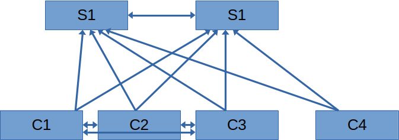

# Role Name


Ansible role for wireguard config.
Unlike wireguard, this role distinguished server from client.

## Requirements

This role requires that you specify wireguard IP (IP address used inside tunnel) for every host (see example inventory later).
You can use IPv6 addresses inside tunnel, I havent tested IPv6 for transport, because I don't have IPv6 at home.


## Role Variables

defaults:
- `wg_interface_name` - name of wireguard interface and config file (config is `wg_interface_name`.conf), default is wg0
- `wg_port` - port on which to start wireguard, default is 51820
- `wg_mode` - whether particular device is in server or client mode (more on that later)

vars/wg_default.yml
- `wg_package` - package name to install. Because it looks like wireguard is packaged in `wireguard-tools` on most distros, I haven't added distro-specific names yet

other variables
- `wg_ip` - IP address to use inside the tunnel
- `wg_mask` - network mask inside tunnel
- `wg_nat_group` - group of devices that are behind nat, but can reach each other (explained later)
- `wg_server_additional_config` and `wg_client_additional_config` - Additional config that is inserted into wireguard config between `[Interface]` and first `[Peer]` sections allowing to add additional interface settings and peers that are not managed by ansible


## Example Playbook

Basic playbook:

```yaml
- name: Install and setup wireguard
  hosts: wg_all

  roles:
    - role: wireguard
      become: true
```

Inventory file:

``` yaml
servers:
  vars:
    wg_mode: "server"
  hosts:
    s1:
      ansible_host: "192.168.122.10"
      wg_ip: "fd0d:1::10"
    s2:
      ansible_host: "192.168.122.11"
      wg_ip: "fd0d:1::11"

clients:
  vars:
    wg_mode: "client"
  hosts:
    c1:
      ansible_host: "192.168.122.12"
      wg_ip: "fd0d:1::12"
    c2:
      ansible_host: "192.168.122.13"
      wg_ip: "fd0d:1::13"
    c3:
      ansible_host: "192.168.122.14"
      wg_ip: "fd0d:1::14"
    c4:
      ansible_host: "192.168.122.15"
      wg_ip: "fd0d:1::15"

wg_all:
  vars:
    wg_mask: "64"
  children:
    clients:
    servers:
```

## Client and server mode

By default all devices are in server mode.
In server mode devices form full mesh topology and each server has specified Endpoint of other servers.

If you set `wg_mode` to "client" for some devices, this role will:
- On servers only specifies public key and allowed IP (not endpoint)
- Servers will have only public key and allowed ip (not endpoint)
- Clients will have all server added as peers with PersistentKeepalive set to 60

### NAT groups

In situations where multiple clients are begind one nat and can reach each other, you can specify nat group.

If you create NAT group, clients in that group will:
- Have all servers as their peers
- Form full mesh with other clients from same NAT group

Inventory file with nat groups can be for example this:

``` yaml
servers:
  vars:
    wg_mode: "server"
  hosts:
    s1:
      ansible_host: "192.168.122.10"
      wg_ip: "fd0d:1::10"
    s2:
      ansible_host: "192.168.122.11"
      wg_ip: "fd0d:1::11"

clients:
  vars:
    wg_mode: "client"
    # Specifies which nat groups will be used for these clients
    wg_nat_group: "nat_1"
  hosts:
    c1:
      ansible_host: "192.168.122.12"
      wg_ip: "fd0d:1::12"
    c2:
      ansible_host: "192.168.122.13"
      wg_ip: "fd0d:1::13"
    c3:
      ansible_host: "192.168.122.14"
      wg_ip: "fd0d:1::14"
    c4:
      ansible_host: "192.168.122.15"
      wg_ip: "fd0d:1::15"

wg_all:
  vars:
    wg_mask: "64"
  children:
    clients:
    servers:

# Defines which clients are in NAT group
nat_1:
  hosts:
    c1:
    c2:
    c3:
```

Note that `wg_natgroup` is set for all clients, but only clients 1-3 are actually added to the nat group.
In this case `wg_nat_group` will be ignored for client `c4` as this client doesn't belong in the group.
Clients 1-3 will form full mesh topology and and client-client communication will not go through servers.
Communication with client 4 will go through server.

In this case, devices will form this topology:



(arrows indicate in which direction is `Endpoint` configured)

## License

GPL 3.0

## Author Information

If you need something regarding this role (bug, improvements to the readme, questions,... ), probably the easiest would be to open an issue on [GitHub](https://github.com/Mearsu/ansible-role-wireguard) or to use contact form on [my website](https://www.matej-vrba.com/en).
